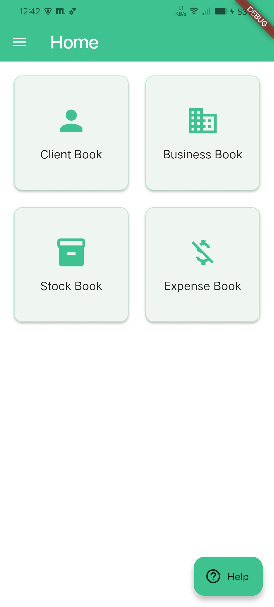
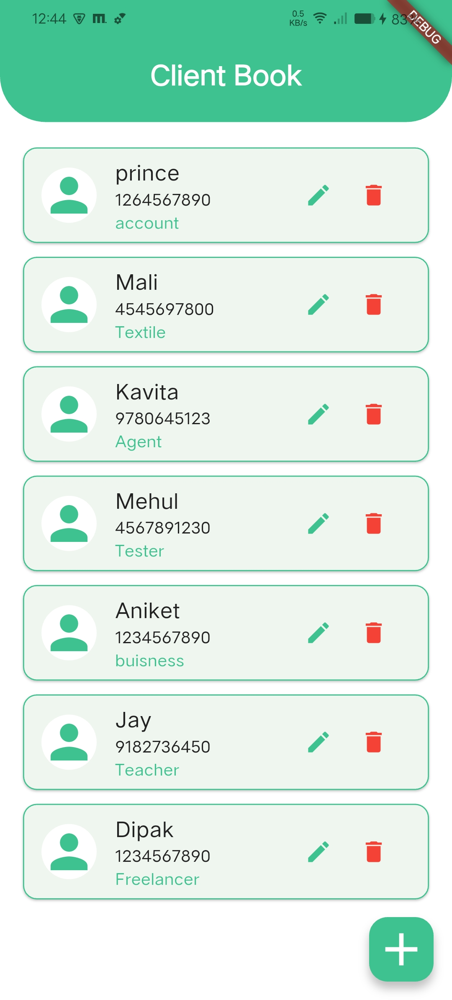
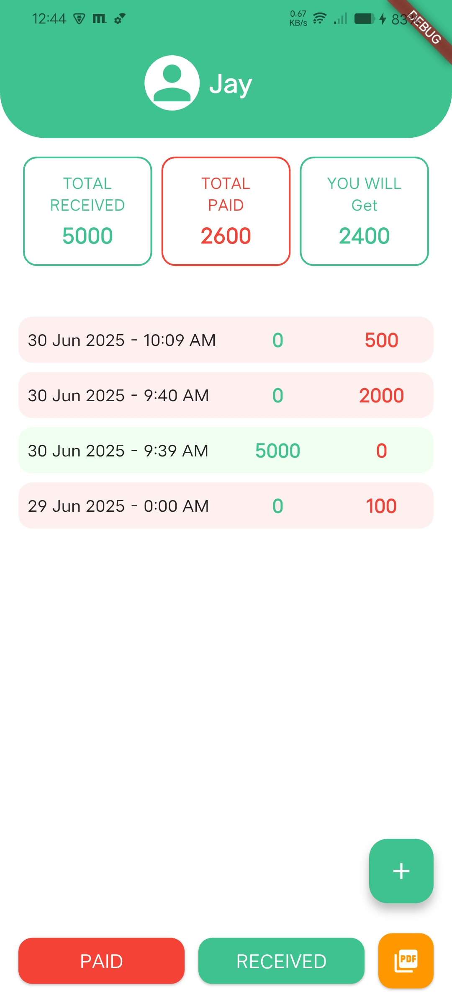
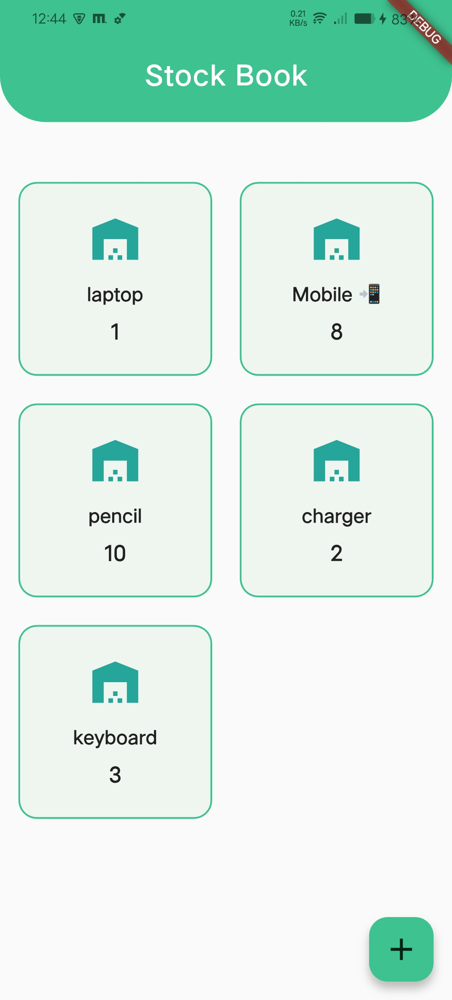
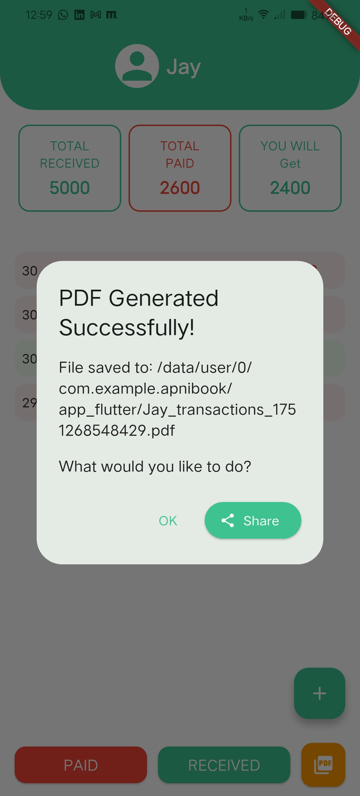
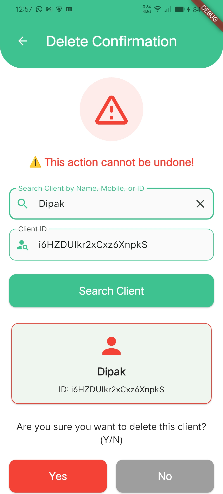
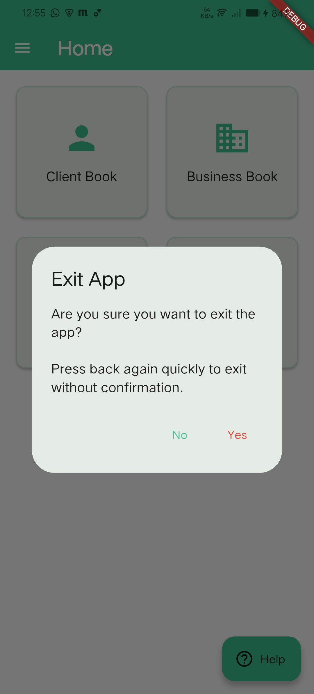

# ApniBook Business Management App - Complete Features Documentation

<!-- APK Download Section -->
## 📦 Download APK

[](apk/ApniBook-App.apk)

*Click the button above to download the latest version of the ApniBook app for Android.*

## 📱 App Overview

**ApniBook** is a comprehensive Flutter-based business management application designed to help small businesses manage their clients, track transactions, manage inventory, and generate reports. The app uses Firebase as the backend and follows clean architecture principles with BLoC pattern for state management.

---

## 🎯 Core Features

### 1. **Splash Screen** ✨

- **Animated Introduction**: Beautiful Lottie animation (books.json) with 3.5-second duration
- **Branding**: Displays creator information (SofTonik)
- **Auto Navigation**: Automatically redirects to dashboard after animation
- **Visual Appeal**: Circular background with white overlay and centered animation

<!-- Splash screen screenshot -->

*Splash screen with animation and branding*

### 2. **Dashboard/Home Screen** 🏠

- **Navigation Hub**: Central access point to all app features
- **Drawer Menu**: Side navigation with organized feature categories
- **Grid Layout**: Card-based interface for quick feature access
- **Exit Confirmation**: Double-tap back button to exit with confirmation dialog
- **Feature Cards**:
  - Client Book
  - Business Book (placeholder)
  - Stock Book
  - Expense Book (placeholder)

<!-- Dashboard screenshot -->

*Dashboard with feature cards and navigation*

### 3. **Client Management System** 👥

#### 3.1 Client List Page

- **Search Functionality**: Real-time search by name, mobile, or business type
- **Grid/List View**: Responsive card layout with client information
- **Client Cards**: Display name, mobile number, and business type
- **Empty State**: Helpful message when no clients exist
- **Floating Action Button**: Quick access to add new clients

<!-- Client list screenshot -->

*Client list with search and card layout*

#### 3.2 Add/Edit Client Page

- **Form Fields**:
  - Client Name (required, min 2 characters)
  - Mobile Number (required, min 10 digits)
  - Business Type (required)
- **Validation**: Real-time form validation with error messages
- **Edit Mode**: Pre-populated fields for existing clients
- **Success Feedback**: SnackBar notifications for operations

<!-- Add client screenshot -->

*Add/Edit client form with validation*

#### 3.3 Client Details Page

- **Transaction Summary**:
  - Total Received amount
  - Total Paid amount
  - Balance calculation (You Will Get)
- **Transaction History**: Chronological list of all transactions
- **Quick Actions**:
  - PAID button (red) - Quick add paid transaction
  - RECEIVED button (green) - Quick add received transaction
  - PDF Export button (orange) - Generate transaction report
- **Floating Action Button**: Add new transaction

<!-- Client transaction screenshot -->

*Client details with transaction summary and actions*

### 4. **Transaction Management System** 💰

#### 4.1 Add Transaction Page

- **Transaction Types**: Paid or Received (pre-selected from client details)
- **Form Fields**:
  - Transaction Type (dropdown)
  - Amount (required, must be > 0)
  - Date picker with time
  - Note (optional)
- **Validation**: Comprehensive input validation
- **Success Handling**: Automatic refresh of client details

#### 4.2 Transaction Display

- **Chronological Order**: Transactions sorted by date/time
- **Visual Indicators**: Color-coded for paid (red) and received (green)
- **Detailed Information**: Date, time, amount, and notes
- **Empty State**: Helpful message when no transactions exist

### 5. **Stock Management System** 📦

#### 5.1 Stock List Page

- **Grid Layout**: 2-column grid display of stock items
- **Stock Cards**: Product name, quantity, and price per unit
- **Empty State**: Message when no stock items exist
- **Floating Action Button**: Add new stock items

<!-- Stock list screenshot -->

*Stock list with grid layout*

#### 5.2 Add/Edit Stock Page

- **Form Fields**:
  - Product Name (required)
  - Quantity (required, must be > 0)
  - Price Per Unit (required, must be > 0)
- **Validation**: Real-time form validation
- **Edit Mode**: Pre-populated fields for existing items

### 6. **PDF Export System** 📄

- **Transaction Reports**: Generate detailed PDF reports for clients
- **Report Content**:
  - Client information (name, ID)
  - Transaction summary (total received, paid, balance)
  - Complete transaction history with dates
  - Professional formatting with app branding
- **Export Options**:
  - Save to device
  - Share via other apps
- **Error Handling**: Graceful error handling for PDF generation

<!-- PDF export screenshot -->

*PDF export options and report preview*

### 7. **Delete Confirmation System** 🗑️

- **Client Deletion**: Secure deletion with multiple confirmation steps
- **Search by Criteria**: Find clients by name, mobile, or ID
- **Final Confirmation**: Clear warning about irreversible action
- **Error Handling**: Proper error messages and validation

<!-- Client ID remove screenshot -->

*Delete client confirmation dialog*

### 8. **Exit Confirmation** 🚪

- **Double-tap Exit**: Press back twice quickly to exit
- **Confirmation Dialog**: "Are you sure you want to exit?" prompt
- **System Integration**: Proper system navigation handling

<!-- Exit confirmation screenshot -->

*Exit confirmation dialog*

---

## 🛠️ Technical Features

### 1. **State Management**

- **BLoC Pattern**: Clean separation of business logic and UI
- **Event-Driven**: Reactive architecture with events and states
- **Dependency Injection**: Service locator pattern for clean architecture

### 2. **Data Management**

- **Firebase Integration**: Cloud Firestore for real-time data
- **Offline Support**: Local data caching capabilities
- **Real-time Updates**: Live data synchronization

### 3. **UI/UX Features**

- **Responsive Design**: Adapts to different screen sizes
- **Material Design**: Modern Material Design 3 components
- **Custom Theme**: Consistent color scheme and typography
- **Loading States**: Proper loading indicators
- **Error Handling**: User-friendly error messages

### 4. **Navigation**

- **Drawer Navigation**: Side menu for feature access
- **Stack Navigation**: Proper back navigation
- **Route Management**: Organized routing system

---

## 📱 Platform Support

- **Android**: Full support with native Android features
- **iOS**: Full support with native iOS features
- **Web**: Web platform support
- **Desktop**: Windows, macOS, and Linux support

---

## 🔧 Dependencies & Technologies

### Core Dependencies

- **Flutter**: 3.8.0+ SDK
- **Firebase Core**: ^3.6.0
- **Cloud Firestore**: ^5.4.3
- **Flutter BLoC**: ^9.1.1
- **Equatable**: ^2.0.7
- **Dartz**: ^0.10.1

### UI & Animation

- **Lottie**: ^3.3.1 (for splash animations)
- **Cupertino Icons**: ^1.0.8

### PDF & File Management

- **PDF**: ^3.10.7 (PDF generation)
- **Path Provider**: ^2.1.2 (file system access)
- **Share Plus**: ^7.2.1 (file sharing)

### State & Dependency Management

- **Get It**: ^8.0.3 (dependency injection)
- **Shared Preferences**: ^2.5.3 (local storage)

---

## 🏗️ Architecture

### Clean Architecture

- **Presentation Layer**: UI components and BLoC widgets
- **Domain Layer**: Business logic, entities, and use cases
- **Data Layer**: Repositories, data sources, and models

### Feature Organization

```
lib/
├── core/           # Shared utilities, constants, services
├── features/       # Feature-based modules
│   ├── client/     # Client management
│   ├── stock/      # Stock management
│   ├── transaction/# Transaction management
│   ├── dashboard/  # Dashboard functionality
│   └── splash/     # Splash screen
└── main.dart       # App entry point
```

---

## 🚀 Future Enhancements (Planned)

- **Business Book**: Additional business management features
- **Expense Book**: Expense tracking and management
- **User Authentication**: Firebase Auth integration
- **Backup & Restore**: Data backup functionality
- **Multi-language Support**: Internationalization
- **Cloud Functions**: Automated business processes
- **Analytics Dashboard**: Business insights and reports
- **Offline Mode**: Enhanced offline capabilities

---

## 📋 Development Guidelines

- **Minimal Code**: Efficient, concise implementations
- **Low Impact**: Changes don't affect existing features
- **Commented Code**: Clear documentation and comments
- **Clean Architecture**: Proper separation of concerns
- **Error Handling**: Comprehensive error management
- **Testing**: Unit and widget testing support

---

*This documentation covers all current features of the ApniBook Business Management App as of the latest version.*
